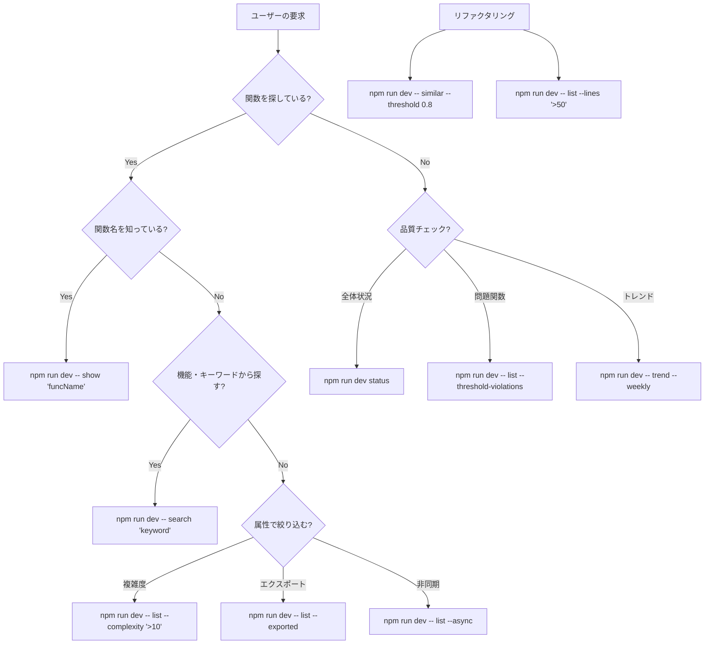

# funcqc AI統合ガイド

## 🤖 AI アシスタント向けコマンド選択フローチャート

### 状況判断 → 最適コマンド選択



## 🎯 用途別コマンドマトリクス

| 目的 | 第1選択 | 第2選択 | 詳細確認 |
|------|---------|---------|----------|
| **関数発見** | `search "keyword"` | `list --name "*pattern*"` | `show "funcName"` |
| **品質確認** | `status` | `list --threshold-violations` | `trend --weekly` |
| **問題調査** | `list --complexity ">10"` | `similar --threshold 0.8` | `show "problemFunc"` |
| **コードレビュー** | `list --exported --complexity ">5"` | `list --no-description` | `diff branch1 branch2` |

## 🔍 ユーザー要求の解釈パターン

### パターン1: 関数探索
**ユーザー**: "handleAuth関数を見つけたい"
```bash
# Step 1: 関数名で直接検索
npm run dev -- show "handleAuth"

# Step 2: 見つからない場合はパターン検索
npm run dev -- list --name "*Auth*"

# Step 3: キーワード検索
npm run dev -- search "authentication"
```

### パターン2: 品質問題の調査
**ユーザー**: "複雑すぎる関数を見つけたい"
```bash
# Step 1: 問題関数の特定
npm run dev -- list --threshold-violations

# Step 2: 複雑度でソート
npm run dev -- list --complexity ">10" --sort complexity:desc --limit 10

# Step 3: 詳細分析
npm run dev -- show "mostComplexFunction"
```

### パターン3: リファクタリング計画
**ユーザー**: "リファクタリングすべき箇所を教えて"
```bash
# Step 1: 重複コード検出
npm run dev -- similar --threshold 0.8

# Step 2: 大きな関数特定
npm run dev -- list --lines ">50" --complexity ">10"

# Step 3: 品質トレンド確認
npm run dev -- trend --weekly
```

## 🧠 AI思考プロセス

### 段階的情報収集
```bash
# Level 1: 概要把握
npm run dev status

# Level 2: 問題領域特定
npm run dev -- list --threshold-violations

# Level 3: 詳細分析
npm run dev -- show "specificFunction"

# Level 4: 関連情報
npm run dev -- search "relatedKeyword"
```

### 情報の優先順位
1. **即座実行**: `status` (全体把握)
2. **問題特定**: `list --threshold-violations` (課題発見)
3. **詳細調査**: `show` (深掘り分析)
4. **横断調査**: `search` (関連探索)

## ⚡ 効率的なコマンド連鎖

### シーケンス1: 品質調査
```bash
npm run dev status                          # 1. 全体状況
npm run dev -- list --threshold-violations # 2. 問題関数
npm run dev -- show "問題関数名"            # 3. 詳細分析
npm run dev -- search "関連キーワード"       # 4. 関連関数探索
```

### シーケンス2: 関数調査
```bash
npm run dev -- search "機能キーワード"       # 1. 大まかな検索
npm run dev -- list --name "*pattern*"     # 2. 名前パターン
npm run dev -- show "目的関数"              # 3. 詳細確認
npm run dev -- list --file "同一ファイル"   # 4. 同一ファイル内関数
```

## 🎨 出力形式の使い分け

### 人間向け表示 (デフォルト)
```bash
npm run dev -- list --threshold-violations
# → 表形式、色付き、絵文字付きの読みやすい出力
```

### AI処理向け (JSON)
```bash
npm run dev -- list --threshold-violations --json
# → 構造化データ、プログラム処理可能
```

### パイプライン処理
```bash
npm run dev -- list --json | jq '.[] | select(.complexity > 10) | .name'
# → 条件抽出、他ツールとの連携
```

## 🚨 エラー回避ガイド

### よくある間違い
❌ `npm run dev list --threshold-violations`
✅ `npm run dev -- list --threshold-violations`

❌ `npm run dev show functionName`
✅ `npm run dev -- show "functionName"`

### オプション指定の注意点
- 複数単語は引用符で囲む: `"function name"`
- 特殊文字はエスケープ: `"*Auth*"`
- `--` を忘れずに: `npm run dev -- command`

## 📊 出力サンプルとその解釈

### status コマンド出力例
```
📊 funcqc Status
══════════════════════════════════════════════════

🎯 Quality Overview
──────────────────────────────
  Overall Grade: C (77/100)
  ⚠️ High Risk Functions: 17 need attention
```
**解釈**: プロジェクトは中程度の品質、17の関数が要改善

### threshold-violations 出力例
```
🚨 Threshold Violations (10 functions)

 1. ⚠️ buildFilters() [ID: 6f832c2d]
   📍 src/cli/list.ts:173
   📊 Metrics: CC=13, LOC=59, Params=2
   🎯 Risk Level: HIGH (score: 30.0)
```
**解釈**: buildFilters関数が複雑度13で高リスク

## 🔄 反復改善のパターン

### 品質改善サイクル
```bash
# 1. 問題特定
npm run dev -- list --threshold-violations

# 2. 原因分析  
npm run dev -- show "問題関数"

# 3. 関連調査
npm run dev -- search "関連キーワード"

# 4. 改善後確認
npm run dev scan
npm run dev -- list --threshold-violations
```

## 💡 AI向けベストプラクティス

### 情報収集の効率化
1. **広く浅く**: `status` で全体把握
2. **狭く深く**: `show` で詳細分析
3. **横断的に**: `search` で関連発見
4. **継続的に**: `trend` で変化追跡

### ユーザーへの報告
1. **要約**: 主要な発見を簡潔に
2. **詳細**: 具体的な関数名・ファイル名
3. **推奨**: 次のアクションを明確に
4. **根拠**: funcqcの出力を引用

### コマンド選択の原則
- **迷ったら**: `status` から開始
- **探索中**: `search` を優先
- **詳細要**: `show` で深掘り
- **比較要**: `--json` で構造化データ取得