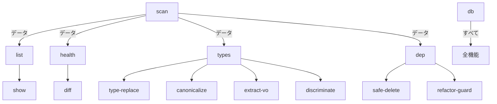

# funcqc機能インベントリ

## 概要
funcqc（Function Quality Control）のすべての機能を体系的に整理し、各機能の目的、対象問題、成熟度を評価する。

## 機能分類マトリクス

### 1. コア分析機能（Core Analysis）

| 機能名 | 主目的 | 対象問題 | 成熟度 | 実行時間 | 出力形式 |
|--------|--------|----------|--------|----------|----------|
| **scan** | メトリクス収集 | 関数品質測定 | ★★★★★ | 50-100s | DB/JSON |
| **analyze** | 遅延分析実行 | 既存データ活用 | ★★★★☆ | 10-30s | DB |
| **list** | 関数一覧表示 | 関数の発見・絞り込み | ★★★★★ | <1s | Table/JSON |
| **show** | 詳細情報表示 | 個別関数分析 | ★★★★☆ | <1s | Text |
| **files** | ファイル情報表示 | ファイルレベル分析 | ★★★☆☆ | <1s | Table |

### 2. 品質評価機能（Quality Assessment）

| 機能名 | 主目的 | 対象問題 | 成熟度 | 特徴 |
|--------|--------|----------|--------|------|
| **health** | プロジェクト健全性評価 | 全体品質把握 | ★★★★★ | 構造的リスク分析 |
| **diff** | スナップショット比較 | 変更影響分析 | ★★★★☆ | 時系列分析 |
| **history** | 変更履歴分析 | 品質の変遷追跡 | ★★★☆☆ | 履歴管理 |
| **evaluate** | 命名品質評価 | 可読性向上 | ★★☆☆☆ | NLP分析 |
| **eval** | リアルタイム評価 | AI生成コード検証 | ★★★☆☆ | リアルタイム |

### 3. 問題検出機能（Issue Detection）

| 機能名 | 主目的 | 対象問題 | 成熟度 | 検出対象 |
|--------|--------|----------|--------|----------|
| **detect** | アンチパターン検出 | 非効果的分割 | ★★★☆☆ | ineffective-splits |
| **similar** | 重複コード検出 | 保守性向上 | ★★★★☆ | AST類似性 |
| **safe-delete** | デッドコード分析 | 不要コード除去 | ★★★★☆ | 到達不能関数 |
| **residue-check** | デバッグコード検出 | 本番品質確保 | ★★★☆☆ | console.log等 |

### 4. 依存関係分析（Dependency Analysis）

| 機能名 | 主目的 | 対象問題 | 成熟度 | 分析深度 |
|--------|--------|----------|--------|----------|
| **dep list** | 依存関係一覧 | 結合度把握 | ★★★★☆ | 基本 |
| **dep show** | 詳細依存分析 | 影響範囲分析 | ★★★★★ | 深い |
| **dep stats** | 依存統計 | 全体構造把握 | ★★★☆☆ | 統計 |
| **dep lint** | アーキテクチャ検証 | 設計原則遵守 | ★★★★☆ | ルール |
| **dep dead** | デッド関数検出 | 不要コード特定 | ★★★☆☆ | 到達性 |
| **dep cycles** | 循環依存検出 | 構造改善 | ★★★★☆ | SCC分析 |

### 5. 型システム分析（Type System Analysis）

| 機能名 | 主目的 | 対象問題 | 成熟度 | DB駆動 |
|--------|--------|----------|--------|--------|
| **types list** | 型一覧表示 | 型の発見 | ★★★★☆ | ✅ |
| **types health** | 型品質分析 | 型設計改善 | ★★★★☆ | ✅ |
| **types deps** | 型依存関係 | 型結合度分析 | ★★★☆☆ | ✅ |
| **types api** | API設計分析 | インターフェース改善 | ★★★☆☆ | ✅ |
| **types members** | メンバー詳細 | 型構造理解 | ★★★☆☆ | ✅ |
| **types coverage** | 利用カバレッジ | 未使用プロパティ | ★★★☆☆ | ✅ |
| **types cluster** | プロパティクラスタ | パターン発見 | ★★☆☆☆ | ✅ |
| **types risk** | 変更リスク分析 | 影響度評価 | ★★★☆☆ | ✅ |
| **types insights** | 包括分析 | 総合判断支援 | ★★★☆☆ | ✅ |
| **types slices** | パターン発見 | 再利用可能性 | ★★☆☆☆ | ✅ |
| **types subsume** | 構造包含関係 | 冗長性分析 | ★★☆☆☆ | ✅ |
| **types fingerprint** | 行動指紋分析 | 機能クラスタ | ★★☆☆☆ | ✅ |
| **types converters** | 変換ネットワーク | 正規化分析 | ★★☆☆☆ | ✅ |
| **types cochange** | 共進化パターン | Git履歴分析 | ★★☆☆☆ | ✅ |

### 6. リファクタリング支援（Refactoring Support）

| 機能名 | 主目的 | 対象問題 | 成熟度 | 安全性 |
|--------|--------|----------|--------|--------|
| **refactor-guard** | リファクタリング安全性 | 変更リスク軽減 | ★★★★☆ | 高 |
| **type-replace** | 型置換支援 | 安全な型変更 | ★★★☆☆ | 中 |
| **canonicalize** | DTO正規化 | 重複型統合 | ★★★☆☆ | 中 |
| **extract-vo** | Value Object抽出 | カプセル化改善 | ★★★☆☆ | 中 |
| **discriminate** | 判別共用体変換 | 型安全性向上 | ★★★☆☆ | 中 |
| **du** | DU段階的変換 | 安全な型進化 | ★★★★☆ | 高 |

### 7. 管理・設定機能（Management & Configuration）

| 機能名 | 主目的 | 対象問題 | 成熟度 | 用途 |
|--------|--------|----------|--------|------|
| **init** | 初期設定 | プロジェクト開始 | ★★★★☆ | セットアップ |
| **config** | 設定管理 | カスタマイズ | ★★★☆☆ | 設定 |
| **db** | データベース管理 | データ操作 | ★★★★☆ | 管理 |
| **describe** | 関数説明管理 | ドキュメント化 | ★★☆☆☆ | 文書化 |
| **search** | キーワード検索 | 関数発見 | ★★☆☆☆ | 検索 |

## 機能依存関係マップ

## 成熟度評価基準

- **★★★★★** : 完全実装、安定、高精度
- **★★★★☆** : 主要機能完成、一部改善余地
- **★★★☆☆** : 基本実装済み、機能拡張必要
- **★★☆☆☆** : プロトタイプレベル、要改良
- **★☆☆☆☆** : 実験的実装、大幅改善必要

## データフロー

1. **入力**: TypeScript ソースコード
2. **スキャン**: `scan` コマンドでメトリクス収集
3. **蓄積**: SQLite データベースに保存
4. **分析**: 各種分析機能でデータ活用
5. **出力**: レポート、JSON、推奨アクション

## 特徴的な独自機能

1. **構造的リスク分析**: 循環依存・Hub関数による品質ペナルティ
2. **PageRank中心性**: 重要度に基づく優先順位付け
3. **AST-based 類似性**: 高精度なコード重複検出
4. **型システム包括分析**: 14種類の型品質指標
5. **段階的DU変換**: 安全な型進化支援
6. **アーキテクチャlint**: カスタムルールによる設計検証

## 競合ツールとの差別化

| 領域 | 競合ツール | funcqcの優位性 |
|------|------------|----------------|
| 複雑度分析 | ESLint, SonarQube | 構造的リスク考慮 |
| 重複検出 | PMD, CPD | AST意味解析 |
| 型分析 | TypeScript Compiler | 品質指標・統計分析 |
| リファクタリング | IDE機能 | 安全性評価・段階的変換 |
| アーキテクチャ | ArchUnit | 動的依存関係分析 |
