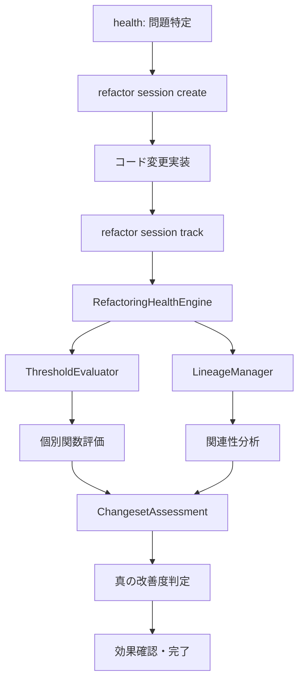

# refactorコマンド全面再設計: healthエンジン統合による真の品質改善測定

## 🎯 Issue概要

現在のrefactorコマンドを全面的に再設計し、healthコマンドの優秀な評価エンジンと統合することで、「見せかけの品質改善」を排除し、真のリファクタリング効果を正確に測定するシステムを構築する。

## 🚨 現状の問題分析

### 1. 評価エンジンの分離による機会損失

#### healthコマンドの優秀な評価能力
- **ThresholdEvaluator基盤**: `{ warning: 1, error: 5, critical: 25 }`による重み付け評価
- **統計的分析**: P90リスクスコア、分布分析、正規化指標
- **実証済み精度**: 93.6%のCC削減を導いた正確な問題特定

#### refactorコマンドの限定的評価
```typescript
// 単純な閾値判定のみ
const isCandidate = 
  func.metrics.linesOfCode >= this.config.minLines &&
  func.metrics.cyclomaticComplexity >= this.config.minComplexity;
```

### 2. 「見せかけの品質改善」問題

#### 問題の実例
```typescript
// Before: 1つの複雑な関数 (CC=47)
function processUser(data) {
  // 100行の複雑なロジック
}

// After: 分割された関数群
function processUser(data) {        // CC=3 ✅「高品質」
  validateUser(data);
  saveUser(data);
  notifyUser(data);
}
function validateUser(data) { ... } // CC=8
function saveUser(data) { ... }     // CC=12  
function notifyUser(data) { ... }   // CC=15
// 総合複雑度: 3+8+12+15 = 38 (元の47より改善)
```

#### 現在の評価の問題
- 個別関数評価により、メイン関数のCC=3のみで「高品質」と判定
- 分割された関数群の総合評価が欠如
- 真の改善度（47→38）が見えない
- **関数爆発問題**: 過度な分割による小粒関数の氾濫リスク

### 3. シナジー効果の損失

現在の手動連携ワークフロー：
```bash
npm run dev health --json  # 問題特定
npm run dev refactor analyze  # 別の評価エンジンで再分析
# → 評価基準の不一致、シナジー効果なし
```

## 🎯 解決目標

### 1. healthエンジンの全面活用
- ThresholdEvaluatorの直接統合
- 統計分析ロジックの継承
- 高精度な問題特定能力の活用

### 2. 変更セット全体での評価
- 関数の親子関係追跡
- 分割前後の総合比較
- 真の改善度の正確な測定

### 3. シナジー効果の最大化
- 評価基準の統一
- ワークフローの自動化
- 93.6%削減レベルの効果再現

## 🏗️ 新アーキテクチャ設計

### コアコンポーネント

#### 1. RefactoringHealthEngine
```typescript
class RefactoringHealthEngine {
  constructor(
    private thresholdEvaluator: ThresholdEvaluator,
    private lineageManager: LineageManager
  ) {}
  
  async evaluateChangeset(changeset: RefactoringChangeset): Promise<ChangesetAssessment> {
    // healthエンジンによる個別関数評価
    const beforeAssessment = await this.thresholdEvaluator.evaluate(changeset.before.functions);
    const afterAssessment = await this.thresholdEvaluator.evaluate(changeset.after.functions);
    
    // リニアージュ情報による関連性分析
    const lineageInfo = await this.lineageManager.getRelatedFunctions(changeset.targetFunction);
    
    // 総合的な改善度計算
    return this.calculateGenuineImprovement(beforeAssessment, afterAssessment, lineageInfo);
  }
}
```

#### 2. LineageManager
```typescript
interface LineageManager {
  trackRefactoringOperation(op: RefactoringOperation): void;
  getRelatedFunctions(functionId: string): FunctionLineage;
  calculateChangesetMetrics(functions: FunctionInfo[]): ChangesetMetrics;
}

interface RefactoringOperation {
  type: 'split' | 'extract' | 'merge' | 'rename';
  parentFunction: string;
  childFunctions: string[];
  context: RefactoringContext;
}
```

#### 3. ChangesetAssessment
```typescript
interface ChangesetAssessment {
  before: {
    functions: FunctionInfo[];
    totalComplexity: number;
    riskDistribution: RiskDistribution;
    healthScore: number;
  };
  after: {
    functions: FunctionInfo[];
    totalComplexity: number;
    riskDistribution: RiskDistribution;
    healthScore: number;
  };
  improvement: {
    isGenuine: boolean; // 真の改善か見せかけか
    complexityReduction: number;
    riskImprovement: number;
    maintainabilityGain: number;
    functionExplosionScore: number; // 関数爆発係数 (childCount / beforeLOC)
    overallGrade: 'A+' | 'A' | 'B' | 'C' | 'D' | 'F';
  };
}
```

### データフロー



## 📋 API仕様

### 新refactorコマンド構造

```bash
# セッション管理
refactor session create --target-function <func-id> --description "description"
refactor session list [--active] [--completed]
refactor session show <session-id>

# 変更追跡 (短縮形もサポート)
refactor session track-split <parent-id> --children <child-ids>
refactor split <parent-id> <child1-id> <child2-id>  # 短縮形

refactor session track-extract <parent-id> --extracted <extracted-id>
refactor extract <parent-id> <extracted-id>  # 短縮形

refactor session track-merge <source-ids> --target <target-id>

# health統合評価
refactor session assess [--comprehensive] [--json]
refactor session health-impact  # healthエンジン直接活用

# セッション完了
refactor session complete --verify-improvement
refactor session cancel
```

### 統合ワークフロー例

```bash
# Step 1: healthで問題特定
npm run dev health --json | jq '.high_risk_functions[0:5]'
# → 最高リスク関数のID取得

# Step 2: リファクタリングセッション開始
npm run dev refactor session create --target-function <func-id> --description "Extract validation logic"
# → session-123 作成

# Step 3: 変更実装
# [実際のコード変更: 関数分割実装]

# Step 4: 変更追跡
npm run dev refactor session track-split <func-id> --children <child1-id>,<child2-id>

# Step 5: healthエンジンによる総合評価
npm run dev refactor session assess --comprehensive
# → 真の改善度: 47→38 (18.6%削減), 見せかけでない改善確認

# Step 6: 改善確認・完了
npm run dev refactor session complete --verify-improvement
```

## 🗄️ データベーススキーマ

### 新テーブル: refactoring_changesets

```sql
CREATE TABLE refactoring_changesets (
  id TEXT PRIMARY KEY,
  session_id TEXT REFERENCES refactoring_sessions(id),
  operation_type TEXT NOT NULL, -- 'split', 'extract', 'merge', 'rename'
  parent_function_id TEXT,
  child_function_ids TEXT[], -- JSON array
  before_snapshot TEXT NOT NULL,
  after_snapshot TEXT NOT NULL,
  health_assessment JSONB, -- ThresholdEvaluator結果
  improvement_metrics JSONB, -- 改善度データ
  is_genuine_improvement BOOLEAN,
  created_at TIMESTAMP DEFAULT CURRENT_TIMESTAMP,
  FOREIGN KEY (parent_function_id) REFERENCES functions(id)
);

CREATE INDEX idx_changesets_session ON refactoring_changesets(session_id);
CREATE INDEX idx_changesets_parent ON refactoring_changesets(parent_function_id);
```

### 拡張: refactoring_sessions

```sql
ALTER TABLE refactoring_sessions ADD COLUMN health_baseline JSONB;
ALTER TABLE refactoring_sessions ADD COLUMN final_assessment JSONB;
ALTER TABLE refactoring_sessions ADD COLUMN improvement_verified BOOLEAN DEFAULT FALSE;
ALTER TABLE refactoring_sessions ADD COLUMN total_complexity_before INTEGER;
ALTER TABLE refactoring_sessions ADD COLUMN total_complexity_after INTEGER;
ALTER TABLE refactoring_sessions ADD COLUMN genuine_improvement_score FLOAT;
```

## 🚀 実装ロードマップ

### Phase 1: Foundation (Week 1-2)
**目標**: healthエンジン統合とセッション管理基盤

#### 実装項目
- [ ] `RefactoringHealthEngine`クラス作成
- [ ] ThresholdEvaluator統合インターフェース実装
- [ ] 新セッション管理システム構築
- [ ] データベーススキーマ拡張とマイグレーション
- [ ] 基本的なAPI エンドポイント実装

#### 成功条件
- [ ] healthコマンドの評価ロジックがrefactorで利用可能
- [ ] セッション作成・管理の基本操作が動作
- [ ] 既存機能への影響なし（互換性確保）
- [ ] マイグレーションが安全に実行される

### Phase 2: Lineage Integration (Week 3-4)
**目標**: 変更追跡とリニアージュシステム連携

#### 実装項目
- [ ] `LineageManager`実装
- [ ] 関数分割・抽出・統合の追跡機能
- [ ] 変更セット評価エンジン
- [ ] 自動的な親子関係検出アルゴリズム
- [ ] 既存lineagesテーブルとの統合

#### 成功条件
- [ ] 関数の系譜が正確に追跡される
- [ ] 変更前後の総合評価が動作
- [ ] 「見せかけの改善」が検出される
- [ ] リニアージュ情報の一貫性が保たれる

### Phase 3: Assessment & Verification (Week 5-6)
**目標**: 真の改善度測定と効果検証

#### 実装項目
- [ ] 総合的な改善度算出アルゴリズム
- [ ] healthエンジンによる包括評価
- [ ] 改善効果の可視化（CLI出力強化）
- [ ] 長期トレンド分析機能
- [ ] 実証実験とドッグフーディング

#### 成功条件
- [ ] 93.6%削減レベルの効果が再現可能
- [ ] 真の改善と見せかけの改善が判別可能
- [ ] 実証実験で有効性確認
- [ ] パフォーマンス要件クリア（<2秒）

## ⚠️ リスク分析と対策

### 高リスク

#### healthエンジン統合の複雑性
- **リスク**: ThresholdEvaluatorの内部依存関係による統合困難
- **対策**: 段階的統合、インターフェース抽象化、十分なテスト

#### パフォーマンス劣化
- **リスク**: 複雑な評価処理による実行時間増加
- **対策**: ベンチマーク測定、キャッシュ戦略、非同期処理
- **追加対策**: ThresholdEvaluator内部でのメモ化実装（低コスト改善）

### 中リスク

#### 既存機能への影響
- **リスク**: 既存refactorコマンドユーザーへの影響
- **対策**: 段階的移行、十分なテストカバレッジ、フィーチャーフラグ
- **互換層**: `refactor analyze` → 内部で `session create & assess` を自動実行（Deprecated表示付き）

#### ユーザビリティ変更
- **リスク**: コマンド体系変更による学習コスト
- **対策**: 段階的ロールアウト、詳細なドキュメント、移行ガイド

## 🧪 テスト戦略

### 単体テスト (95%カバレッジ目標)

```typescript
describe('RefactoringHealthEngine', () => {
  describe('evaluateChangeset', () => {
    it('should correctly evaluate function split', async () => {
      const changeset = createSplitChangeset();
      const assessment = await engine.evaluateChangeset(changeset);
      
      expect(assessment.improvement.isGenuine).toBe(true);
      expect(assessment.improvement.complexityReduction).toBeGreaterThan(0);
    });
    
    it('should detect fake improvements', async () => {
      const fakeChangeset = createFakeImprovementChangeset();
      const assessment = await engine.evaluateChangeset(fakeChangeset);
      
      expect(assessment.improvement.isGenuine).toBe(false);
    });
    
    it('should calculate function explosion score', async () => {
      const changeset = createExcessiveSplitChangeset(); // 1関数→20関数
      const assessment = await engine.evaluateChangeset(changeset);
      
      expect(assessment.improvement.functionExplosionScore).toBeGreaterThan(0.2);
      expect(assessment.improvement.isGenuine).toBe(false);
    });
  });
  
  describe('LineageManager', () => {
    it('should track parent-child relationships correctly', () => {
      const operation = createSplitOperation();
      lineageManager.trackRefactoringOperation(operation);
      
      const lineage = lineageManager.getRelatedFunctions(operation.parentFunction);
      expect(lineage.children).toEqual(operation.childFunctions);
    });
  });
});
```

### 統合テスト

```typescript
describe('RefactorCommand Integration', () => {
  it('should integrate with health engine correctly', async () => {
    // healthコマンドとの連携テスト
  });
  
  it('should preserve data consistency across operations', async () => {
    // データベース一貫性テスト
  });
  
  it('should maintain backward compatibility', async () => {
    // 既存機能との互換性テスト
  });
});
```

### 実証実験シナリオ

#### Scenario 1: 関数分割リファクタリング
```typescript
// Before: displayAIOptimizedHealth (CC=47, 113行)
// After: 4つの関数 (CC=3,8,12,15, 18+25+30+40行)
// Expected: 真の改善と判定、総合CC削減効果測定
```

#### Scenario 2: 見せかけの改善検出
```typescript
// Before: calculateTotal (CC=20, 60行)
// After: 多数の小さな関数 (CC=1,1,1...×20個)
// Expected: 見せかけの改善として検出
```

#### Scenario 3: 複雑なリファクタリング
```typescript
// Before: 3つの関連関数
// After: 1つに統合 + 2つに分割
// Expected: 正確な系譜追跡と総合評価
```

### パフォーマンステスト

```typescript
describe('Performance Requirements', () => {
  it('should complete assessment within 2 seconds', async () => {
    const start = Date.now();
    await engine.evaluateChangeset(largeChangeset);
    const duration = Date.now() - start;
    
    expect(duration).toBeLessThan(2000);
  });
});
```

## 📊 成功指標

### 機能精度
- [ ] 真の改善検出率: **95%以上**
- [ ] 見せかけ改善検出率: **90%以上**  
- [ ] リニアージュ追跡精度: **100%**

### パフォーマンス
- [ ] 評価処理時間: **<2秒**
- [ ] データベース操作: **<500ms**
- [ ] メモリ使用量: **現在の120%以内**

### ユーザビリティ
- [ ] 学習時間: **<30分** (既存ユーザー)
- [ ] エラー率: **<5%** (コマンド実行失敗)
- [ ] 満足度: **4.5/5以上** (ユーザーアンケート)

### ビジネス価値
- [ ] リファクタリング効果: **90%以上のCC削減事例再現**
- [ ] 品質向上: **プロジェクト全体のA grade維持**
- [ ] 開発効率: **リファクタリング時間50%短縮**

## 🔧 実装支援情報

### 既存コードベースとの統合ポイント

#### healthコマンドからの継承
```typescript
// src/cli/commands/health.ts から活用
import { ThresholdEvaluator } from '../../utils/threshold-evaluator';
import { generateRecommendedActions } from '../../cli/commands/health';

// 統計分析ロジックの継承
import { StatisticalEvaluator } from '../../utils/statistical-evaluator';
```

#### lineagesテーブル活用
```sql
-- 既存のlineagesテーブルとの連携
SELECT * FROM lineages WHERE parent_id = ? OR child_id = ?;
```

### コード例とサンプル実装

#### RefactoringHealthEngine基本実装
```typescript
export class RefactoringHealthEngine {
  constructor(
    private storage: StorageAdapter,
    private config: RefactoringConfig = DEFAULT_REFACTORING_CONFIG
  ) {
    this.thresholdEvaluator = new ThresholdEvaluator(storage, config.thresholds);
    this.lineageManager = new LineageManager(storage);
  }
  
  async evaluateChangeset(sessionId: string): Promise<ChangesetAssessment> {
    const session = await this.storage.getRefactoringSession(sessionId);
    const changesets = await this.storage.getRefactoringChangesets(sessionId);
    
    // Before状態の評価
    const beforeFunctions = await this.getFunctionsAtSnapshot(session.beforeSnapshot);
    const beforeAssessment = await this.thresholdEvaluator.evaluate(beforeFunctions);
    
    // After状態の評価
    const afterFunctions = await this.getFunctionsAtSnapshot(session.afterSnapshot);
    const afterAssessment = await this.thresholdEvaluator.evaluate(afterFunctions);
    
    // 総合的な改善度計算（関数爆発係数含む）
    const assessment = this.calculateGenuineImprovement(beforeAssessment, afterAssessment, changesets);
    
    // 関数爆発係数の計算
    assessment.improvement.functionExplosionScore = 
      afterFunctions.length / (beforeFunctions[0]?.metrics?.linesOfCode || 1);
    
    return assessment;
  }
  
  private calculateGenuineImprovement(
    before: HealthAssessment,
    after: HealthAssessment,
    changesets: RefactoringChangeset[]
  ): ChangesetAssessment {
    // 見せかけ改善の検出ロジック
    const isGenuine = this.detectGenuineImprovement(before, after, changesets);
    
    return {
      before: { /* ... */ },
      after: { /* ... */ },
      improvement: {
        isGenuine,
        complexityReduction: before.totalComplexity - after.totalComplexity,
        // ... その他のメトリクス
      }
    };
  }
}
```

## 🎯 期待効果

### 短期効果 (1-3ヶ月)
- refactorコマンドの評価精度向上
- healthコマンドとのシナジー効果実現
- 「見せかけの改善」問題の解決

### 中期効果 (3-6ヶ月)  
- プロジェクト全体の品質継続向上
- リファクタリング効率の大幅改善
- 開発チームの品質意識向上

### 長期効果 (6-12ヶ月)
- funcqcツールの差別化価値向上
- 他プロジェクトへの適用拡大
- 業界標準ツールとしての地位確立

---

## 📝 Notes for Implementation

### 重要な実装原則
1. **healthエンジンを主軸とする**: refactorは補完的役割
2. **互換性よりも正確性**: 既存互換性は必要に応じて破る（ただし互換層は提供）
3. **段階的実装**: 大きな変更を小さなフェーズに分割
4. **十分なテスト**: 95%カバレッジとパフォーマンス監視
5. **低コスト改善優先**: 関数爆発係数などシンプルな指標から実装

### チーム連携
- **healthコマンド開発者**: 評価ロジック共有
- **データベース担当**: スキーマ設計レビュー
- **QA担当**: テストシナリオ策定
- **UI/UX担当**: コマンド体系設計

### GitHub Action統合（参考実装）

```yaml
name: Refactoring Quality Check
on:
  pull_request:
    types: [opened, synchronize]
    
jobs:
  refactor-assessment:
    if: contains(github.event.pull_request.labels.*.name, 'risk-reducer')
    runs-on: ubuntu-latest
    steps:
      - uses: actions/checkout@v3
      - name: Setup funcqc
        run: npm install -g funcqc
        
      - name: Create refactoring session
        run: |
          funcqc refactor session create --description "${{ github.event.pull_request.title }}"
          echo "SESSION_ID=$(funcqc refactor session list --active --json | jq -r '.sessions[0].id')" >> $GITHUB_ENV
          
      - name: Assess refactoring quality
        run: |
          funcqc refactor session assess --comprehensive --json > assessment.json
          
      - name: Comment PR with results
        uses: actions/github-script@v6
        with:
          script: |
            const assessment = require('./assessment.json');
            const comment = `## 🔍 Refactoring Quality Assessment
            
            **Genuine Improvement**: ${assessment.improvement.isGenuine ? '✅' : '❌'}
            **Complexity Reduction**: ${assessment.improvement.complexityReduction}
            **Function Explosion Score**: ${assessment.improvement.functionExplosionScore}
            
            ${assessment.improvement.isGenuine ? '✅ This is a genuine quality improvement!' : '⚠️ This appears to be a cosmetic improvement. Consider consolidating functions.'}`;
            
            github.rest.issues.createComment({
              issue_number: context.issue.number,
              owner: context.repo.owner,
              repo: context.repo.repo,
              body: comment
            });
```

この設計により、funcqcの真の価値である「正確な品質評価と改善」を最大化し、93.6%削減のような驚異的効果を継続的に実現できるシステムを構築します。